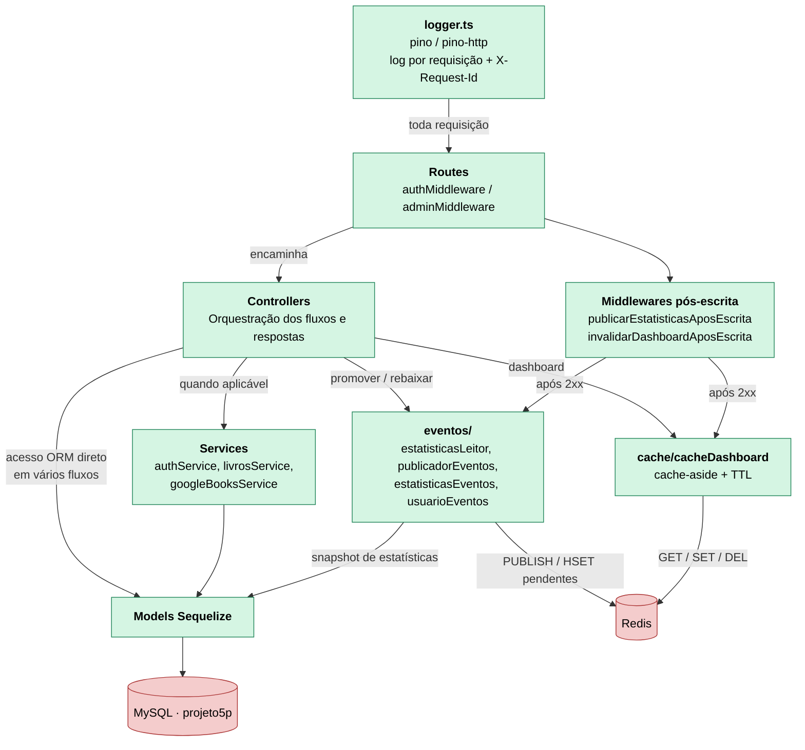

# C4 — Nível 3: Componentes do Backend Principal (Express)

```mermaid
flowchart TB
    logger["<b>logger.ts</b><br/>pino / pino-http<br/>log por requisição + X-Request-Id"]
    routes["<b>Routes</b><br/>authMiddleware / adminMiddleware"]
    mw["<b>Middlewares pós-escrita</b><br/>publicarEstatisticasAposEscrita<br/>invalidarDashboardAposEscrita"]
    controllers["<b>Controllers</b><br/>Orquestração dos fluxos e respostas"]
    services["<b>Services</b><br/>authService, livrosService,<br/>googleBooksService"]
    eventos["<b>eventos/</b><br/>estatisticasLeitor, publicadorEventos,<br/>estatisticasEventos, usuarioEventos"]
    cache["<b>cache/cacheDashboard</b><br/>cache-aside + TTL"]
    models["<b>Models Sequelize</b>"]
    mysql[("MySQL · projeto5p")]
    redis[("Redis")]

    logger -- "toda requisição" --> routes
    routes --> mw
    routes -- encaminha --> controllers
    controllers -- "quando aplicável" --> services
    controllers -- "acesso ORM direto<br/>em vários fluxos" --> models
    controllers -- dashboard --> cache
    controllers -- "promover / rebaixar" --> eventos
    mw -- "após 2xx" --> eventos
    mw -- "após 2xx" --> cache
    services --> models
    eventos -- "snapshot de estatísticas" --> models
    models --> mysql
    eventos -- "PUBLISH / HSET pendentes" --> redis
    cache -- "GET / SET / DEL" --> redis

    classDef comp fill:#d5f5e3,stroke:#23865b,color:#000
    classDef dados fill:#f4cccc,stroke:#aa3333,color:#000
    class logger,routes,mw,controllers,services,eventos,cache,models comp
    class mysql,redis dados
```
