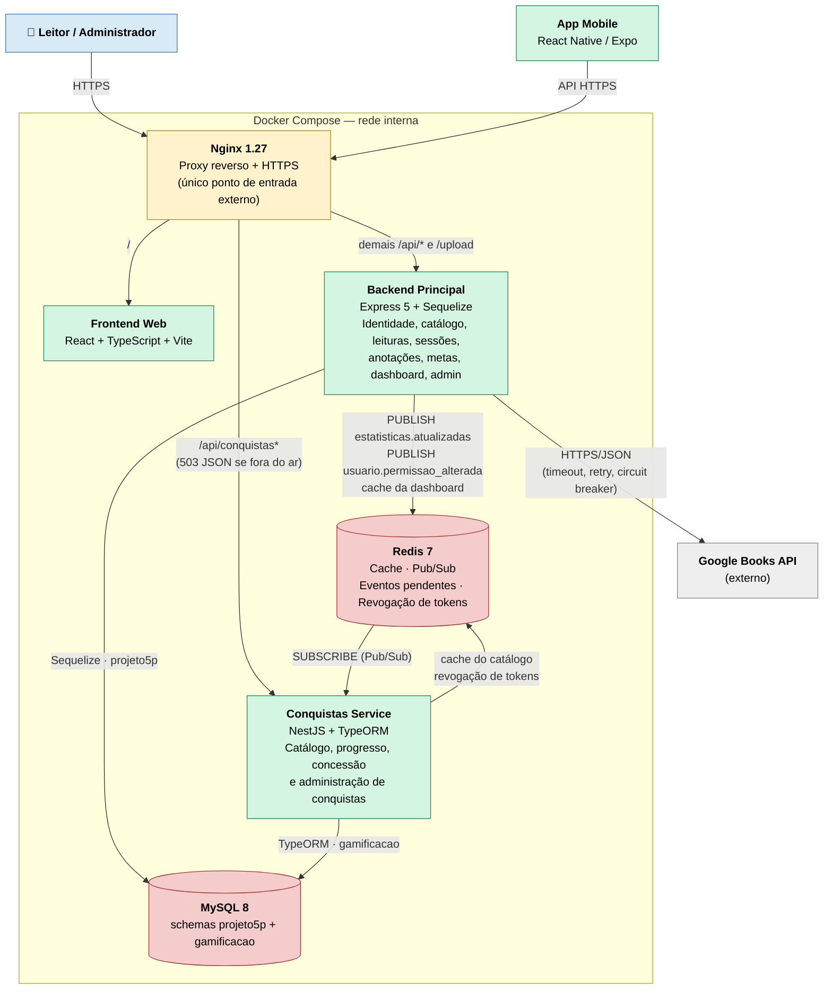

# C4 — Nível 2: Containers

Os containers do Docker Compose, o app mobile e como eles se comunicam.

```mermaid
flowchart TB
    usuarios["👤 <b>Leitor / Administrador</b>"]
    mobile["<b>App Mobile</b><br/>React Native / Expo"]

    subgraph compose["Docker Compose — rede interna"]
        nginx["<b>Nginx 1.27</b><br/>Proxy reverso + HTTPS<br/>(único ponto de entrada externo)"]
        web["<b>Frontend Web</b><br/>React + TypeScript + Vite"]
        express["<b>Backend Principal</b><br/>Express 5 + Sequelize<br/>Identidade, catálogo, leituras, sessões,<br/>anotações, metas, dashboard, admin"]
        nest["<b>Conquistas Service</b><br/>NestJS + TypeORM<br/>Catálogo, progresso, concessão<br/>e administração de conquistas"]
        redis[("<b>Redis 7</b><br/>Cache · Pub/Sub<br/>Eventos pendentes · Revogação de tokens")]
        mysql[("<b>MySQL 8</b><br/>schemas projeto5p + gamificacao")]
    end

    google["<b>Google Books API</b><br/>(externo)"]

    usuarios -- HTTPS --> nginx
    mobile -- "API HTTPS" --> nginx
    nginx -- "/" --> web
    nginx -- "demais /api/* e /upload" --> express
    nginx -- "/api/conquistas*<br/>(503 JSON se fora do ar)" --> nest
    express -- "Sequelize · projeto5p" --> mysql
    nest -- "TypeORM · gamificacao" --> mysql
    express -- "PUBLISH estatisticas.atualizadas<br/>PUBLISH usuario.permissao_alterada<br/>cache da dashboard" --> redis
    redis -- "SUBSCRIBE (Pub/Sub)" --> nest
    nest -- "cache do catálogo<br/>revogação de tokens" --> redis
    express -- "HTTPS/JSON<br/>(timeout, retry, circuit breaker)" --> google

    classDef pessoa fill:#d9eaf7,stroke:#4a789e,color:#000
    classDef app fill:#d5f5e3,stroke:#23865b,color:#000
    classDef proxy fill:#fff2cc,stroke:#b8860b,color:#000
    classDef dados fill:#f4cccc,stroke:#aa3333,color:#000
    classDef externo fill:#eeeeee,stroke:#888888,color:#000
    class usuarios pessoa
    class mobile,web,express,nest app
    class nginx proxy
    class redis,mysql dados
    class google externo
```