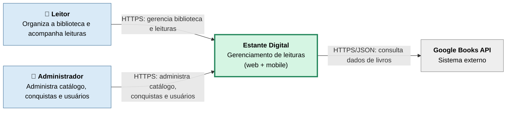

# C4 — Nível 1: Contexto

Quem usa o sistema e com quais sistemas externos ele conversa.

```mermaid
flowchart LR
    leitor["👤 <b>Leitor</b><br/>Organiza a biblioteca e acompanha leituras"]
    admin["👤 <b>Administrador</b><br/>Administra catálogo, conquistas e usuários"]
    sistema["<b>Estante Digital</b><br/>Gerenciamento de leituras<br/>(web + mobile)"]
    google["<b>Google Books API</b><br/>Sistema externo"]

    leitor -- "HTTPS: gerencia biblioteca e leituras" --> sistema
    admin -- "HTTPS: administra catálogo,<br/>conquistas e usuários" --> sistema
    sistema -- "HTTPS/JSON: consulta dados de livros" --> google

    classDef pessoa fill:#d9eaf7,stroke:#4a789e,color:#000
    classDef sist fill:#d5f5e3,stroke:#23865b,stroke-width:3px,color:#000
    classDef externo fill:#eeeeee,stroke:#888888,color:#000
    class leitor,admin pessoa
    class sistema sist
    class google externo
```