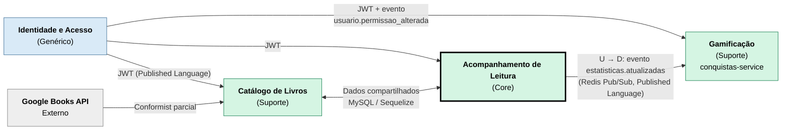

# Context Map

```mermaid
flowchart LR
    identidade["<b>Identidade e Acesso</b><br/>(Genérico)"]
    catalogo["<b>Catálogo de Livros</b><br/>(Suporte)"]
    leitura["<b>Acompanhamento de Leitura</b><br/>(Core)"]
    gamificacao["<b>Gamificação</b><br/>(Suporte)<br/>conquistas-service"]
    google["<b>Google Books API</b><br/>Externo"]

    identidade -- "JWT (Published Language)" --> catalogo
    identidade -- JWT --> leitura
    identidade -- "JWT + evento<br/>usuario.permissao_alterada" --> gamificacao
    catalogo <-- "Dados compartilhados<br/>MySQL / Sequelize" --> leitura
    google -- "Conformist parcial" --> catalogo
    leitura -- "U → D: evento estatisticas.atualizadas<br/>(Redis Pub/Sub, Published Language)" --> gamificacao

    classDef generico fill:#d9eaf7,stroke:#4a789e,color:#000
    classDef suporte fill:#d5f5e3,stroke:#23865b,color:#000
    classDef core fill:#d5f5e3,stroke:#000,stroke-width:3px,color:#000
    classDef externo fill:#eeeeee,stroke:#888888,color:#000
    class identidade generico
    class catalogo,gamificacao suporte
    class leitura core
    class google externo
```

Explicação de cada relação em [arquitetura/context-map.md](../arquitetura/context-map.md).
